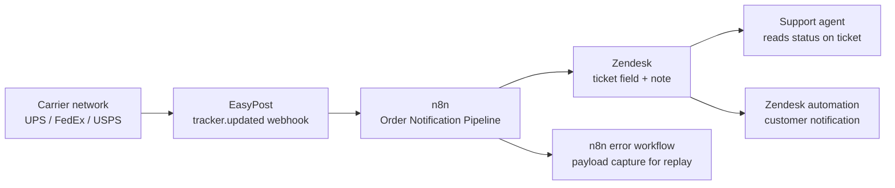
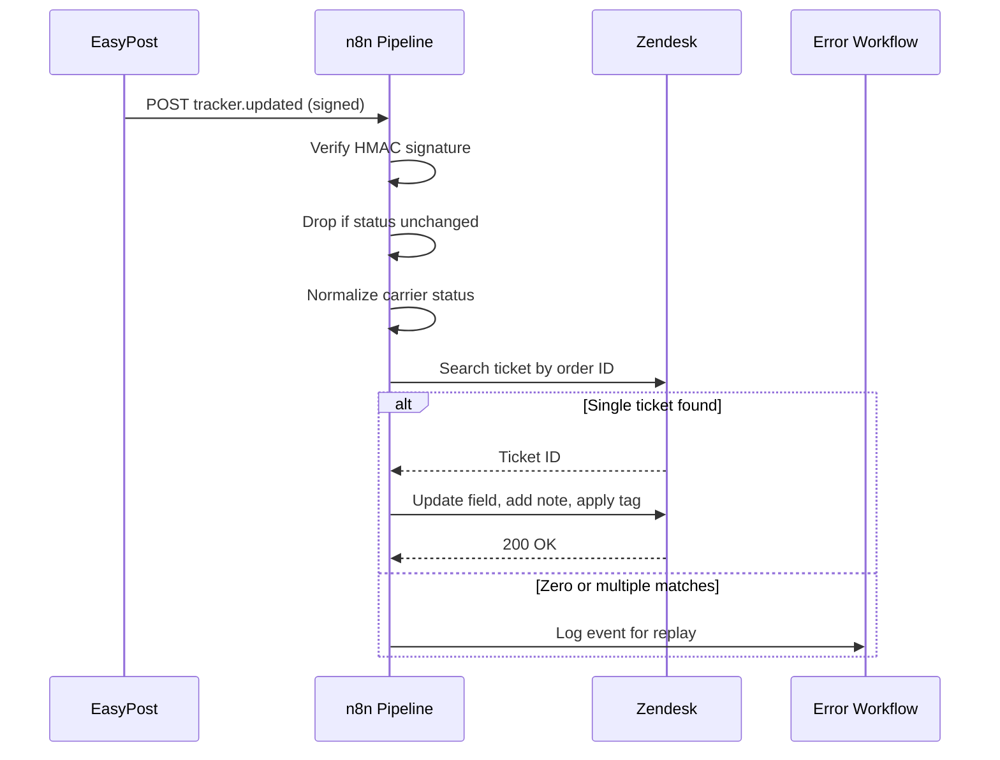

# Order Notification Pipeline — Runbook

## Document Metadata

- **Document type:** Runbook / Support Operations Doc
- **Intended audience:** Support operations, on-call engineers, systems analysts
- **Repo/system examined:** `lumen-supply/ops-automation` — n8n workflow `Order Notification Pipeline`
- **Date:** 2026-05
- **Confidence level:** High for documented flow and failure modes; assumptions and unknowns flagged inline
- **Status:** Portfolio sample — built on a fictional scenario (Lumen Supply Co.). In a real engagement, every artifact link in the Traceability section resolves to the client's repository.

---

## Executive Summary

The Order Notification Pipeline keeps Lumen Supply's support team and customers informed about shipment progress without anyone manually checking carrier websites. When a parcel changes status — picked up, in transit, out for delivery, delivered, or exception — the carrier reports it to EasyPost, EasyPost forwards a webhook to an n8n workflow, and that workflow translates the carrier's status into Lumen's own status vocabulary and writes it back to the matching Zendesk ticket.

For a support agent, this means the order's current shipping state is visible directly on the ticket, in plain language, the moment it changes. For the customer, it means proactive "your order is on its way" and "your order was delivered" notifications fire without an agent touching anything.

This runbook describes what the pipeline does, what it depends on, how it fails, and what to do when it does.

---

## Business Purpose

Lumen Supply ships roughly 5,000 orders per week across UPS, FedEx, and USPS, all booked through EasyPost. Before this pipeline existed, "where is my order?" tickets were resolved by an agent copying a tracking number into a carrier site, reading the status, and typing it back to the customer — several minutes per ticket, repeated thousands of times a month.

The pipeline removes that manual lookup from the common path. Its operational value is threefold:

- **Agent time.** Shipment status appears on the ticket automatically, so "where is my order?" tickets are answered from information already present rather than a live lookup.
- **Customer experience.** Delivered and exception events drive proactive notifications, reducing inbound contact volume.
- **Consistency.** Three carriers report status in three different vocabularies. The pipeline normalizes them into one set of statuses, so agents read a single consistent language regardless of carrier.

Because the pipeline sits between the carrier network and the support team, an outage is not catastrophic — orders still ship and deliver — but it degrades support quality silently. Tickets stop updating, and no one notices until a customer asks. That makes monitoring (below) the most important section of this document.

---

## Scope

### In Scope

- The n8n workflow that receives EasyPost tracking webhooks and updates Zendesk tickets.
- Carrier-to-internal status normalization logic.
- The order-to-ticket lookup mechanism.
- Failure modes, monitoring signals, and recovery steps for the above.

### Out of Scope

- The EasyPost shipment booking flow (a separate workflow that creates labels and registers trackers).
- Zendesk trigger/automation logic that fires customer-facing emails off the updated fields. The pipeline writes the field; downstream Zendesk automations decide what to send.
- Carrier accuracy. If a carrier reports a wrong status, the pipeline faithfully propagates it.

---

## Functional Behavior

The workflow is triggered by an inbound webhook and runs as a short linear pipeline with one branch for exception handling.

1. **Receive and verify.** An n8n Webhook node receives an HTTP POST from EasyPost each time a registered tracker changes status. The first step verifies the EasyPost webhook signature (HMAC-SHA256 over the raw body using the shared webhook secret). Unverified requests are rejected with `401` and not processed further.

2. **Filter and deduplicate.** EasyPost can deliver the same event more than once, and not every event is meaningful. The workflow drops events whose normalized status equals the last status already recorded on the ticket, preventing duplicate notes and redundant Zendesk writes.

3. **Normalize status.** The carrier's status — EasyPost exposes a unified `tracker.status` plus carrier-specific `tracking_details` — is mapped to Lumen's internal vocabulary via a lookup table in a Code node. EasyPost's tracker statuses (`pre_transit`, `in_transit`, `out_for_delivery`, `delivered`, `available_for_pickup`, `return_to_sender`, `failure`, `cancelled`, `error`, `unknown`) collapse into Lumen's five customer-facing states: `Label Created`, `In Transit`, `Out for Delivery`, `Delivered`, `Delivery Issue`.

4. **Resolve the ticket.** The workflow reads the Lumen order ID, which is carried on the tracker as EasyPost metadata set at booking time. It searches Zendesk for the open ticket tagged with that order ID. If exactly one ticket is found, the flow proceeds; zero or multiple matches divert to the exception branch.

5. **Update Zendesk.** The workflow updates a custom ticket field (`shipping_status`) with the normalized status, appends an internal note recording the carrier, tracking number, normalized status, and timestamp, and applies a status tag. A `Delivery Issue` status additionally applies a `shipping_exception` tag that a separate Zendesk automation uses to route the ticket to a specialist queue.

6. **Handle exceptions.** Lookup failures, unmapped statuses, and Zendesk write errors are logged to a dedicated n8n error workflow that records the full event payload for later replay.

---

## Data Inputs / Outputs

| Area | Inputs | Outputs | Notes |
|------|--------|---------|-------|
| Webhook intake | EasyPost `tracker.updated` event (JSON), `X-Hmac-Signature` header | Verified event object, or `401` rejection | Signature verified against the webhook secret before any processing |
| Status normalization | EasyPost `tracker.status`, `tracking_details[]`, carrier code | Lumen internal status (one of five) | Unmapped statuses default to no field change and raise a warning |
| Ticket resolution | Lumen order ID from tracker metadata | Single Zendesk ticket ID, or exception | Relies on the order ID being set at booking time |
| Zendesk write | Ticket ID, normalized status, carrier, tracking number | Updated `shipping_status` field, internal note, status tag | Public-facing emails are driven by downstream Zendesk automations, not this workflow |

---

## Dependencies

| Dependency | Type | Why It Matters |
|------------|------|----------------|
| EasyPost webhooks | External | Source of all status events. If EasyPost stops sending or the endpoint URL changes, the pipeline receives nothing and fails silently. |
| EasyPost tracker metadata | External (config) | The order ID is read from tracker metadata set during booking. If booking stops setting it, ticket resolution fails for every event. |
| n8n instance (self-hosted) | Internal | The workflow only runs while the instance is up and the workflow is active. n8n holds no inbound queue — events that arrive while it is down are lost unless EasyPost retries. |
| Zendesk API | External | Target system. Subject to per-minute rate limits; sustained bursts return `429`. |
| Zendesk custom field `shipping_status` | Internal (config) | The field ID is referenced directly. If the field is deleted or its ID changes, writes fail with `422`. |
| Webhook shared secret | Internal (secret) | Used for signature verification. A rotated secret that is not updated in n8n rejects all events as `401`. |

---

## Risks / Failure Modes

| Failure Mode | Impact | Detection | Response |
|--------------|--------|-----------|----------|
| n8n instance down or workflow deactivated | All status updates stop; events lost beyond EasyPost retry window | n8n uptime alert; webhook receipt volume drops to zero | Restart instance / reactivate workflow; replay missed events from EasyPost event log |
| Webhook secret rotated without updating n8n | Every event rejected as `401`; updates stop | Spike in `401` responses; receipt volume normal but zero successful executions | Update the secret in n8n credentials; replay rejected events |
| Zendesk rate limit (`429`) | Updates delayed or dropped during high-volume bursts | Zendesk `429` rate in execution logs | Confirm retry/backoff is active; throttle batch size; spread load |
| Order ID missing from tracker metadata | Ticket resolution fails; ticket never updates | "Ticket not found" entries in error workflow | Fix booking workflow to set metadata; backfill affected orders manually |
| Unmapped carrier status | Field not updated for that event; possible gap in customer notifications | "Unmapped status" warnings in error workflow | Add the status to the normalization table; redeploy; replay affected events |
| Duplicate webhook delivery | Without dedup, duplicate notes and redundant writes | Repeated identical notes on a ticket | Confirm dedup step is functioning; dedup compares against last recorded status |
| Multiple tickets match one order | Ambiguous resolution; event diverted to exception | "Multiple tickets" entries in error workflow | Merge or correct duplicate tickets; re-run the event |

---

## Monitoring / Support Implications

Because this pipeline fails quietly, monitoring is the difference between a five-minute fix and a customer-reported outage that has been running for days.

### What to Monitor

- **Webhook receipt volume.** Expected steady-state volume tracks shipping volume. A drop to near zero during business hours is the strongest signal that intake has broken.
- **n8n execution success rate.** The ratio of successful to failed executions on this workflow.
- **Zendesk API error rate.** Specifically `429` (rate limit) and `422` (field/validation) responses.
- **Exception workflow volume.** Counts of "ticket not found", "multiple tickets", and "unmapped status". A sudden rise points to a specific upstream break.

### Common Alerts / Symptoms

- Tickets stop showing shipping status updates (most common customer-visible symptom).
- Spike in `401` responses (signature/secret problem).
- Spike in `429` responses (rate limit during a volume burst).
- Rising "unmapped status" warnings (a carrier introduced or began using a status not in the table).

### Initial Triage Guidance

1. **Check whether events are arriving.** Look at webhook receipt volume. Zero during business hours points to EasyPost delivery, endpoint, or instance availability — not the workflow logic.
2. **If events arrive but fail, read the response code.** `401` → secret/signature. `429` → rate limit. `422` → Zendesk field. Each points to a different cause.
3. **If events succeed but tickets do not update, check the exception workflow.** "Ticket not found" points to order-ID metadata; "unmapped status" points to the normalization table.

### Recovery / Workaround Guidance

- **Instance or workflow down:** restart or reactivate, then replay missed events from the EasyPost event log for the affected window.
- **Secret mismatch:** update the credential in n8n, then replay rejected events.
- **Rate limiting:** confirm backoff is active; reduce concurrency until the burst clears.
- **Unmapped status:** add the mapping, redeploy, replay the affected events.

For any case where events were lost rather than delayed, EasyPost's event log is the system of record for replay. Tickets can also be updated manually in the interim for high-priority customers.

### Escalation Guidance

- **Intake broken (zero events) for more than 30 minutes during business hours:** escalate to the systems/integration owner — this is a silent support-quality outage.
- **Repeated `422` after a Zendesk change:** escalate to the Zendesk administrator; a custom field was likely altered.
- **EasyPost-side delivery failure confirmed:** escalate to the EasyPost account owner.

---

## Mermaid Diagrams

### Context Diagram

### Sequence Diagram

---

## Assumptions / Unknowns

### Assumptions

- **The order ID is set as EasyPost tracker metadata at booking time.** Inferred from ticket resolution reading it from metadata rather than a separate store. Confirmed by inspecting the booking workflow.
- **n8n holds no durable inbound queue.** Inferred from the standard Webhook node behavior; events arriving during downtime depend on EasyPost retries. Confirmed by checking whether a queue or buffer node precedes the trigger.
- **Downstream customer emails are owned by Zendesk automations, not this workflow.** Inferred from the workflow writing fields and tags but not sending messages.

### Unknowns

- The exact EasyPost webhook retry policy and window for this account (governs how much can be recovered after downtime).
- Whether the normalization table is exhaustive across all carrier status codes currently in use, or only the common ones.
- Whether Zendesk rate-limit headroom is sufficient at peak shipping season (e.g., Q4) volume.

---

## Open Questions

- What is the agreed recovery objective if intake breaks — replay all missed events, or accept gaps beyond a certain age?
- Should "multiple tickets match one order" be treated as a data-quality alert routed to support leads, rather than only logged?
- Is there appetite to add a lightweight queue in front of the webhook to eliminate event loss during n8n downtime?

---

## Traceability to Repo Artifacts

> Illustrative for this portfolio sample. In a real engagement these resolve to the client's repository.

| Artifact | Why It Was Used |
|----------|-----------------|
| [order-notification-pipeline.json](https://github.com/lumen-supply/ops-automation/blob/main/workflows/order-notification-pipeline.json) | The n8n workflow export — source of the trigger, flow, and node configuration |
| [status-normalization.js](https://github.com/lumen-supply/ops-automation/blob/main/workflows/lib/status-normalization.js) | The Code node mapping carrier statuses to Lumen's internal vocabulary |
| [error-workflow.json](https://github.com/lumen-supply/ops-automation/blob/main/workflows/error-workflow.json) | The error-handling workflow — source of the exception capture and replay behavior |
| [zendesk-fields.md](https://github.com/lumen-supply/ops-automation/blob/main/docs/zendesk-fields.md) | Reference for the `shipping_status` custom field ID and tag conventions |
