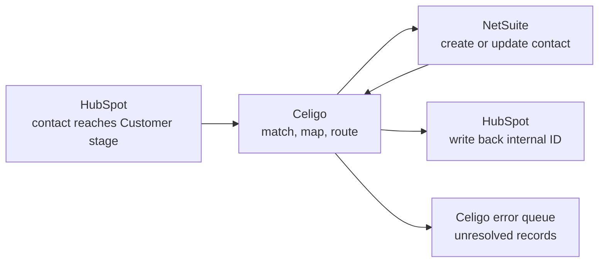
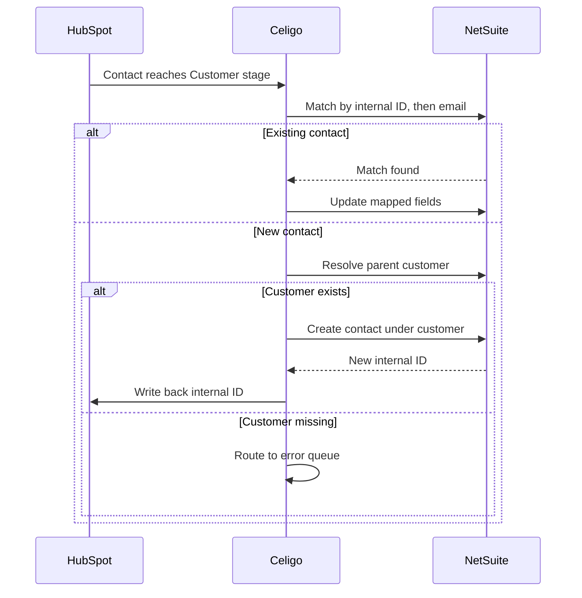

# HubSpot → NetSuite Contact Sync — Integration Specification

## Document Metadata

- **Document type:** Integration Specification
- **Intended audience:** Systems analysts, RevOps, integration engineers, NetSuite administrators
- **Repo/system examined:** Celigo integrator.io flow `HubSpot Customer → NetSuite Contact Sync`
- **Date:** 2026-05
- **Confidence level:** High for documented flow, field mapping, and matching logic; assumptions and unknowns flagged inline
- **Status:** Portfolio sample — built on a fictional scenario (Meridian, a B2B SaaS company). In a real engagement, every artifact link in the Traceability section resolves to the client's environment.

---

## Executive Summary

When a contact in HubSpot becomes a paying customer, their record needs to exist in NetSuite so finance can invoice them. This integration handles that handoff: when a HubSpot contact reaches the `Customer` lifecycle stage, Celigo creates or updates the matching contact under the correct customer in NetSuite, then writes the NetSuite internal ID back to HubSpot so the two systems stay linked for all future updates.

The integration is deliberately one-directional for contact demographic data — HubSpot is the source of truth for who the contact is, NetSuite is the source of truth for the customer's financial relationship. This specification documents the field mapping, the matching and deduplication logic, the source-of-truth decisions, and the consequences of each design choice.

---

## Business Purpose

Meridian's go-to-market motion runs in HubSpot: leads are captured, nurtured, and converted there. Its financial operations run in NetSuite: invoicing, revenue recognition, and the customer master live there. The gap between them is the moment a prospect becomes a customer.

Without this integration, that handoff is manual. A RevOps or finance team member re-keys the new customer's contact details into NetSuite, which is slow, error-prone, and creates duplicate records when the same person is entered twice with slight variations. Duplicate customer records in NetSuite are particularly costly: they fracture invoicing history and require finance to merge records after the fact.

This integration removes the manual re-key and, critically, prevents duplicates through deterministic matching. The design priority is not speed — it is correctness of the customer master.

---

## Scope

### In Scope

- Sync of HubSpot contacts to NetSuite contact records when they reach the `Customer` lifecycle stage.
- Association of the synced contact to the correct NetSuite customer record.
- Matching and deduplication logic to prevent duplicate NetSuite records.
- Write-back of the NetSuite internal ID to HubSpot to maintain the link.

### Out of Scope

- Company-to-customer record creation in NetSuite. This spec assumes the customer record exists or is created by a separate company-sync flow; it documents how the contact associates to it.
- Financial data flowing back from NetSuite to HubSpot (invoices, payment status). That is a separate reverse flow.
- Marketing attributes (email engagement, campaign membership) — these remain in HubSpot and are never synced.
- Deal/opportunity sync.

---

## Integration Overview

- **Source system:** HubSpot (contacts, associated companies)
- **Target system:** NetSuite (contact records associated to customer records)
- **Trigger:** HubSpot contact `lifecyclestage` property changes to `customer`
- **Frequency:** Near-real-time via Celigo's HubSpot listener; falls back to a scheduled flow as a safety net
- **Direction of data flow:** HubSpot → NetSuite (contact demographics); NetSuite → HubSpot (internal ID write-back only)
- **Source of truth:** HubSpot owns contact identity and demographic fields; NetSuite owns the customer financial master and the internal ID

---

## Functional Behavior

The integration runs as a Celigo flow with a matching step that determines create-versus-update before any write occurs.

1. **Trigger and export.** When a HubSpot contact's lifecycle stage becomes `customer`, Celigo's HubSpot connection exports the contact record and its primary associated company.

2. **Match against NetSuite.** Before writing, the flow performs a lookup to decide whether this contact already exists in NetSuite. Matching is deterministic and runs in priority order:
   - First, match on the stored NetSuite internal ID if HubSpot already holds one (the contact was synced before).
   - If no internal ID, match on email address against existing NetSuite contacts.
   - If still no match, treat as a new contact.

   This priority order is the heart of the deduplication strategy. The internal-ID match guarantees that a previously synced contact updates rather than duplicates; the email match catches contacts that exist in NetSuite but were created outside this flow.

3. **Resolve the customer association.** The flow resolves which NetSuite customer the contact belongs under, using the associated company's stored NetSuite customer ID. If the company has no NetSuite customer record, the contact cannot be associated and the record is routed to error handling rather than created as an orphan.

4. **Create or update.** Based on the match result, the flow either creates a new NetSuite contact under the resolved customer, or updates the existing one. Only the mapped demographic fields are written; NetSuite-owned financial fields are never touched.

5. **Write back the internal ID.** On a successful create, the flow writes the new NetSuite internal ID back to a HubSpot custom property (`netsuite_internal_id`). This closes the loop: the next time this contact syncs, step 2 matches on the internal ID and updates cleanly.

---

## Data Inputs / Outputs

### Inputs

| Input | Source | Notes |
|-------|--------|-------|
| Contact record | HubSpot | Triggered on `lifecyclestage = customer` |
| Associated company | HubSpot | Used to resolve the NetSuite customer association |
| Stored NetSuite internal ID | HubSpot custom property | Present only if the contact synced previously; drives the primary match |

### Outputs

| Output | Destination | Notes |
|--------|-------------|-------|
| Contact record (create or update) | NetSuite | Associated to the resolved customer record |
| NetSuite internal ID | HubSpot custom property | Written back on successful create to maintain the link |

### Field Mapping

| HubSpot property | NetSuite field | Direction | Source of truth | Notes |
|------------------|----------------|-----------|-----------------|-------|
| `email` | Email | HubSpot → NetSuite | HubSpot | Also the secondary match key |
| `firstname` | First Name | HubSpot → NetSuite | HubSpot | |
| `lastname` | Last Name | HubSpot → NetSuite | HubSpot | |
| `phone` | Phone | HubSpot → NetSuite | HubSpot | |
| `jobtitle` | Job Title | HubSpot → NetSuite | HubSpot | |
| `associatedcompanyid` → company's `netsuite_customer_id` | Company (customer association) | HubSpot → NetSuite | NetSuite | Resolves the parent customer; not a direct field copy |
| `netsuite_internal_id` | Internal ID | NetSuite → HubSpot | NetSuite | Write-back only, on create |

---

## Dependencies

| Dependency | Type | Why It Matters |
|------------|------|----------------|
| HubSpot connection (Celigo) | External | Source of contact data and the trigger. Token expiry or scope changes break the export. |
| NetSuite connection (Celigo) | External | Target system. Relies on a NetSuite integration role with permission to read and write contacts. |
| NetSuite customer record exists | Internal (data) | A contact cannot be associated without a parent customer. Depends on the separate company-sync flow having run first. |
| HubSpot `netsuite_internal_id` property | Internal (config) | The link field. If removed or renamed, write-back fails and future syncs fall back to email matching. |
| Email data quality | Internal (data) | Email is the secondary match key. Malformed or shared inbox emails weaken deduplication. |

---

## Risks / Failure Modes

| Risk / Failure Mode | Impact | Mitigation / Notes |
|---------------------|--------|--------------------|
| Customer record missing in NetSuite | Contact cannot be associated; routed to error | Ensure company-sync runs before contact-sync; error queue surfaces affected contacts |
| Duplicate NetSuite contact created | Fractured contact history under a customer | Deterministic match order (internal ID → email) is the primary control; monitor create-vs-update ratio |
| Internal ID write-back fails | Next sync falls back to email match; duplicate risk rises | Alert on write-back failures; they are the leading indicator of future duplicates |
| Shared or malformed email | Email match fails or matches the wrong record | Treat email as secondary, never sole, match key; flag shared inboxes in data hygiene |
| NetSuite integration role lacks permission | Writes fail with permission error | Validate role permissions during deployment; document required permissions |
| Lifecycle stage set then reverted | Contact syncs prematurely | Confirm the trigger fires only on forward transition to `customer` |

---

## Monitoring / Support Implications

Celigo integrator.io provides per-flow execution history, error management, and retry. Operationally, the signals that matter most for this flow are:

- **Create-versus-update ratio.** A healthy steady state is mostly updates once the customer base is established. A rising rate of creates for contacts that should already exist is the earliest sign that matching or write-back is failing and duplicates are forming.
- **Internal-ID write-back failures.** These are a leading indicator: every failed write-back is a contact that will fall back to email matching next time, raising duplicate risk.
- **Error queue volume by reason.** "Customer not found" points to company-sync ordering; "permission denied" points to the NetSuite role; "no match, created" trends point to data quality.

Operational ownership sits with RevOps for data-quality issues (emails, lifecycle hygiene) and with the integration owner for connection and mapping issues. Celigo's retry handles transient API failures; persistent errors require human resolution from the error queue.

---

## Mermaid Diagrams

### Context Diagram

### Sequence Diagram

---

## Assumptions / Unknowns

### Assumptions

- **A separate company-sync flow creates the NetSuite customer before contacts sync.** Inferred from the contact flow resolving — rather than creating — the parent customer. Confirmed by checking flow execution order.
- **The trigger fires only on a forward transition to `customer`.** Inferred from the intent to avoid premature syncs. Confirmed by inspecting the HubSpot listener filter.
- **Only demographic fields are mapped; financial fields are NetSuite-owned and untouched.** Inferred from the mapping table containing no financial fields.

### Unknowns

- The exact behavior when a HubSpot contact is associated with multiple companies — which company's NetSuite customer wins.
- Whether email matching is case-insensitive and trims whitespace (affects match reliability).
- How the flow behaves if a contact reaches `customer` stage before the email field is populated.

---

## Open Questions

- Should "customer record missing in NetSuite" hold the contact for retry until the company syncs, or route it to a person immediately?
- Is there a defined data-hygiene process for shared-inbox emails that defeat deduplication?
- When a contact's demographic field changes in HubSpot after creation, should it update NetSuite, or is NetSuite considered frozen post-creation? The source-of-truth rule says HubSpot wins, but this should be confirmed with finance.

---

## Traceability to Repo Artifacts

> Illustrative for this portfolio sample. In a real engagement these resolve to the client's environment.

| Artifact | Why It Was Used |
|----------|-----------------|
| [contact-sync-flow.json](https://github.com/meridian-rev/netsuite-integration/blob/main/celigo/contact-sync-flow.json) | The Celigo flow export — source of the trigger, match order, and routing |
| [contact-field-mapping.json](https://github.com/meridian-rev/netsuite-integration/blob/main/celigo/mappings/contact-field-mapping.json) | The field mapping configuration documented in the mapping table |
| [netsuite-role-permissions.md](https://github.com/meridian-rev/netsuite-integration/blob/main/docs/netsuite-role-permissions.md) | Reference for the NetSuite integration role's required permissions |
| [hubspot-custom-properties.md](https://github.com/meridian-rev/netsuite-integration/blob/main/docs/hubspot-custom-properties.md) | Reference for the `netsuite_internal_id` write-back property |
