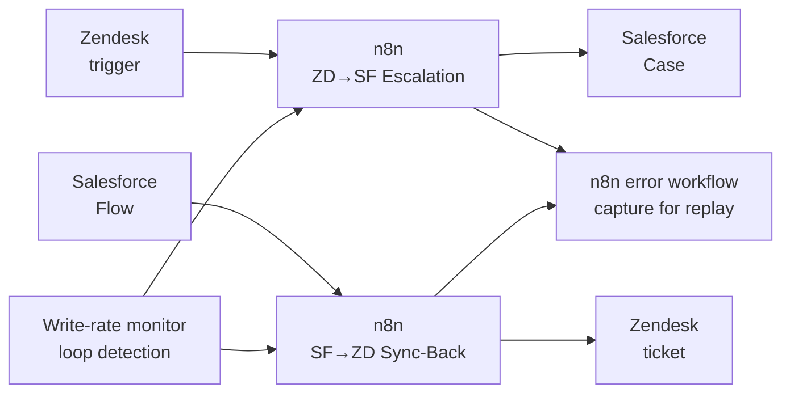
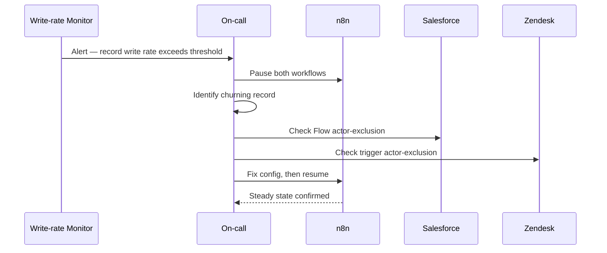

# Salesforce ↔ Zendesk Case Escalation — Runbook

## Document Metadata

- **Document type:** Runbook / Support Operations Doc
- **Intended audience:** On-call engineers, support operations, Salesforce and Zendesk administrators
- **Repo/system examined:** n8n workflows `ZD→SF Escalation` and `SF→ZD Sync-Back`
- **Date:** 2026-05
- **Confidence level:** High for documented failure modes and recovery; assumptions and unknowns flagged inline
- **Status:** Portfolio sample — built on a fictional scenario (Halytech Systems). Companion to the Integration Specification for the same system.

---

## Executive Summary

This runbook covers operating the bidirectional sync between Halytech's Zendesk tickets and Salesforce Cases. The integration links a ticket to a Case on escalation and keeps engineering status flowing back to the support agent.

Two things make this integration operationally distinct from a one-way sync. First, it can form a **sync loop** — the highest-severity failure here, because it generates rapid record churn and burns API capacity in both systems. Second, every recovery action must consider both directions and the loop-prevention controls that hold them apart. This runbook is organized around those realities.

For how the integration is designed — field mapping, source of truth, and the loop-prevention contract — see the companion Integration Specification.

---

## Business Purpose

The integration keeps the support agent's view of an escalated ticket current with engineering's work in Salesforce, without manual transcription in either direction. When it breaks, the visible symptom is usually subtle: tickets stop reflecting engineering progress, agents fall back to asking engineering directly, and customers are told stale information. The exception is a loop, which is loud and damaging. Both are covered below.

---

## Scope

### In Scope

- Detection, triage, and recovery for the escalation and sync-back workflows.
- Loop detection and response.
- Recovery of missed escalations and missed status updates.

### Out of Scope

- The design rationale and field mapping (see the Integration Specification).
- Account/contact/entitlement sync (not part of this integration).
- Changes to the loop-prevention configuration, which are a design change, not an operational action.

---

## Functional Behavior

Operationally, two event-driven workflows run independently:

- **Escalation (`ZD→SF Escalation`)** fires when a Zendesk agent applies the escalation tag, creates a linked Salesforce Case, and stores the Case ID on the ticket.
- **Sync-back (`SF→ZD Sync-Back`)** fires when a linked Salesforce Case changes status or gains a public comment, and writes the mapped status and note back to the ticket.

Each direction excludes changes made by the other side's integration user, which is what stops the two from triggering each other. Detail is in the specification; the operational consequence is that **any change to an integration user or to the triggering rules can reintroduce loop risk.**

---

## Data Inputs / Outputs

| Area | Inputs | Outputs | Notes |
|------|--------|---------|-------|
| Escalation | Zendesk escalation event | Salesforce Case + stored Case ID on ticket | One-time per ticket; guarded by Case-ID presence |
| Sync-back | Salesforce Case change event | Mapped status + internal note on ticket | Written by the Zendesk integration user |
| Link | `salesforce_case_id` / `zendesk_ticket_id` | — | The records find each other through these fields |

---

## Dependencies

| Dependency | Type | Why It Matters |
|------------|------|----------------|
| Zendesk integration user | Internal | Performs sync-back writes; its trigger exclusion is the primary loop control |
| Salesforce integration user | Internal | Performs escalation writes; its Flow exclusion is the other loop control |
| Link fields on both records | Internal | Without them, sync-back cannot find the ticket and escalation cannot guard against repeats |
| Zendesk trigger / Salesforce Flow | Internal | The two entry points; either disabled stops its direction silently |
| n8n instance | Internal | Runs both workflows; no durable inbound queue |
| Salesforce + Zendesk APIs | External | Bidirectional load roughly doubles API pressure versus one-way |

---

## Risks / Failure Modes

| Failure Mode | Impact | Detection | Response |
|--------------|--------|-----------|----------|
| Sync loop | Rapid repeated writes; API exhaustion; record churn | Write-rate-per-record alert; burst of executions on one ticket/Case | Pause both workflows immediately; identify the record; correct the actor-exclusion or skip-unchanged config; resume |
| Escalation trigger disabled | New escalations silently never reach Salesforce | Escalations tagged in Zendesk with no matching Case created | Re-enable the Zendesk trigger; create Cases for the gap manually or by replay |
| Sync-back Flow deactivated | Engineering progress never reaches the ticket | Tickets stop updating while Cases progress | Reactivate the Salesforce Flow; replay recent Case changes |
| Link field cleared | Orphaned records; sync stops for them | Linked record missing its counterpart ID | Restore the link from the other side's stored ID; re-run sync |
| Re-escalation duplicate Case | Two Cases for one ticket | Two Cases sharing one `zendesk_ticket_id` | Merge/close the duplicate; confirm the Case-ID guard is firing |
| Unmapped Salesforce status | Ticket shows stale engineering status | "Unmapped status" warnings | Add mapping; redeploy; replay affected Cases |
| API rate limit | Updates delayed in one or both directions | `429` rate in execution logs | Confirm backoff; reduce concurrency until burst clears |
| n8n down | Both directions stop; events lost beyond source retry | n8n uptime alert; both workflows idle | Restart; replay from Zendesk trigger log and Salesforce Flow/event records |

---

## Monitoring / Support Implications

### What to Monitor

- **Write rate per record (highest priority).** Repeated writes to a single ticket or Case within a short window is a loop. This is the one signal that warrants an immediate page.
- **Escalation balance.** Count of Zendesk escalation tags applied versus Salesforce Cases created. A growing gap means escalation is broken.
- **Sync-back freshness.** Linked Cases changing status without a corresponding ticket update.
- **API error rates.** `429` (rate limit) and `4xx` (validation/permission) across both connections.
- **Unmapped-status warnings.** A new Salesforce status entered use before being mapped.

### Common Alerts / Symptoms

- One record receiving many writes in seconds → loop.
- Escalations tagged but no Case appears → escalation trigger or workflow down.
- Cases progress but tickets stay stale → sync-back Flow or workflow down.
- Spike in `4xx` after an admin change → a field, permission, or integration user changed.

### Initial Triage Guidance

1. **Rule out a loop first.** Check write-rate-per-record. If a record is churning, treat as a loop and pause both workflows before anything else — containment precedes diagnosis.
2. **If no loop, identify the broken direction.** Escalations-without-Cases points to the Zendesk side; Cases-without-ticket-updates points to the Salesforce side.
3. **Read the error reason.** `429` → rate limit. `4xx` → a field/permission/integration-user change. "Unmapped status" → the status map.

### Recovery / Workaround Guidance

- **Loop:** pause both workflows, find the offending record, correct the actor-exclusion or skip-unchanged configuration that failed, then resume. Do not resume until the cause is found — re-enabling into an active loop repeats the damage.
- **Direction down:** re-enable the trigger or Flow, then replay the missed window from that system's logs.
- **Orphaned link:** the counterpart ID still exists on the other record; use it to restore the cleared field, then re-run.
- **Lost events (n8n down):** replay from the Zendesk trigger log and Salesforce Flow/event records for the outage window. For high-priority escalations, create the Salesforce Case manually in the interim.

### Escalation Guidance

- **Active loop:** page the integration owner immediately — this consumes API capacity in both production systems.
- **Escalation broken more than 30 minutes:** notify support and engineering leads; escalated tickets are not reaching engineering.
- **Repeated `4xx` after an admin change on either side:** escalate to that system's administrator; a trigger, Flow, field, or integration user was likely altered.

---

## Mermaid Diagrams

### Context Diagram

### Sequence Diagram — Loop Detection and Containment

---

## Assumptions / Unknowns

### Assumptions

- **A write-rate-per-record signal exists or can be derived from execution logs.** Inferred as the necessary detection for loops. Confirmed by checking monitoring configuration.
- **Each system's logs retain enough history to replay an outage window.** Inferred from replay being the recovery path. Confirmed against Zendesk trigger and Salesforce event retention.

### Unknowns

- Whether pausing one workflow is sufficient to break a loop, or both must be paused (depends on which direction is cycling).
- The retention window of the Salesforce Flow/event records that recovery depends on.
- Whether a circuit breaker auto-halts a churning record, or response is fully manual.

---

## Open Questions

- Should loop detection auto-pause the affected record rather than requiring a manual page? This bounds blast radius at the cost of a resume step.
- What is the agreed recovery objective for a sync-back outage — replay all missed Case changes, or only the latest status per Case?
- Who owns the runbook action when the break is a misconfigured integration user — the system administrator who changed it, or the integration owner?

---

## Traceability to Repo Artifacts

> Illustrative for this portfolio sample. In a real engagement these resolve to the client's environment.

| Artifact | Why It Was Used |
|----------|-----------------|
| [zd-sf-escalation.json](https://github.com/halytech/support-integration/blob/main/workflows/zd-sf-escalation.json) | Escalation workflow — failure modes for the create path |
| [sf-zd-syncback.json](https://github.com/halytech/support-integration/blob/main/workflows/sf-zd-syncback.json) | Sync-back workflow — failure modes for status and note writes |
| [error-workflow.json](https://github.com/halytech/support-integration/blob/main/workflows/error-workflow.json) | Shared error capture and replay behavior |
| [loop-prevention.md](https://github.com/halytech/support-integration/blob/main/docs/loop-prevention.md) | The actor-exclusion contract that recovery must preserve |
