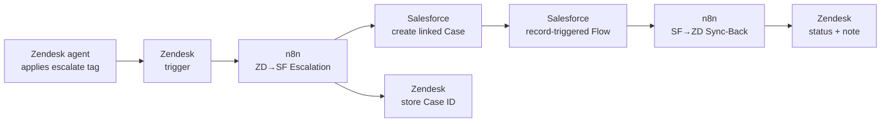
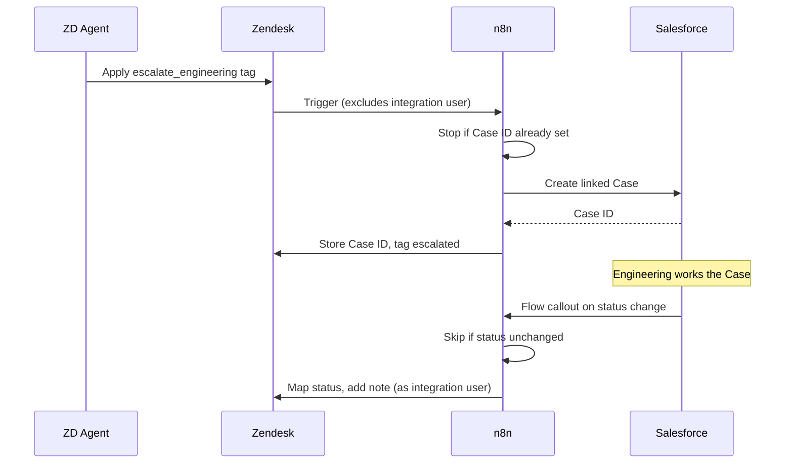

# Salesforce ↔ Zendesk Case Escalation — Integration Specification

## Document Metadata

- **Document type:** Integration Specification
- **Intended audience:** Systems analysts, integration engineers, Salesforce and Zendesk administrators, support and engineering leads
- **Repo/system examined:** n8n workflows `ZD→SF Escalation` and `SF→ZD Sync-Back`
- **Date:** 2026-05
- **Confidence level:** High for documented flow, mapping, and loop-prevention design; assumptions and unknowns flagged inline
- **Status:** Portfolio sample — built on a fictional scenario (Halytech Systems). In a real engagement, every artifact link in the Traceability section resolves to the client's environment.

---

## Executive Summary

When a front-line support ticket needs engineering, the support team should not have to leave Zendesk and the engineering team should not have to live in it. This integration links a Zendesk ticket to a Salesforce Case so each team works in its own system while staying in sync.

When a Zendesk agent escalates a ticket, the integration creates a linked Salesforce Case carrying the ticket's context. As engineering works the Case in Salesforce, status changes and public updates flow back to the Zendesk ticket so the support agent — and the customer — stay informed without anyone re-keying information across systems.

Because data moves in both directions, the integration's central design problem is not the mapping; it is preventing sync loops and deciding which system owns each field. This specification documents both.

---

## Business Purpose

Halytech runs front-line support in Zendesk and engineering escalation tracking in Salesforce. Before this integration, escalation was a copy-paste handoff: an agent summarized the ticket into a Salesforce Case by hand, and any engineering progress had to be manually copied back so the agent could update the customer. The handoff was slow, lossy, and frequently stale — customers were told "still investigating" because the agent had no visibility into the Salesforce side.

This integration closes the loop in both directions. Its value is in keeping two teams aligned across two systems without manual transcription, and in ensuring the customer-facing agent always has the current engineering status. The design priority is correctness and loop safety — a runaway sync loop that updates records in a tight cycle is worse than no integration at all.

---

## Scope

### In Scope

- One-time creation of a linked Salesforce Case when a Zendesk ticket is escalated.
- Ongoing sync of Salesforce Case status and public comments back to the linked Zendesk ticket.
- The bidirectional link between ticket and Case, and the loop-prevention controls that keep the two directions from triggering each other.
- Status mapping between the two systems' distinct status models.

### Out of Scope

- Creation of Zendesk tickets from Salesforce (escalation is always Zendesk-originated in this design).
- Sync of internal Salesforce engineering notes that are not marked customer-facing.
- Account, contact, or entitlement sync between the systems — this covers the case/ticket link only.
- Attachment transfer between systems.

---

## Integration Overview

- **Source system:** Bidirectional — Zendesk originates escalation; Salesforce originates ongoing updates
- **Target system:** Bidirectional
- **Trigger:** Zendesk → Salesforce: a Zendesk trigger fires when the `escalate_engineering` tag is applied. Salesforce → Zendesk: a record-triggered Salesforce Flow fires an outbound callout when a linked Case's status or public comment changes.
- **Frequency:** Event-driven (near-real-time) in both directions
- **Direction of data flow:** Zendesk → Salesforce on escalation; Salesforce → Zendesk on case progress
- **Source of truth:** Split by field — Zendesk owns the customer conversation and original context; Salesforce owns the engineering investigation and resolution status (see Field Mapping)

---

## Functional Behavior

The integration is two event-driven workflows that share one link and a common loop-prevention discipline.

### Escalation: Zendesk → Salesforce

1. A Zendesk agent applies the `escalate_engineering` tag (or sets the escalation field). A Zendesk trigger fires a webhook to the `ZD→SF Escalation` workflow.
2. The workflow checks the ticket's `salesforce_case_id` field. If it is already populated, the ticket has been escalated before and the workflow stops — escalation is a one-time create, not a repeat.
3. The workflow creates a Salesforce Case, mapping the ticket subject, description, requester, priority, and an escalation reason.
4. On success, it writes the new Salesforce Case ID back to the Zendesk ticket's `salesforce_case_id` field and applies an `escalated` tag. The Case ID is the durable link between the two records.

### Sync-back: Salesforce → Zendesk

1. A record-triggered Salesforce Flow fires when a linked Case's status changes or a public comment is added, sending an outbound callout to the `SF→ZD Sync-Back` workflow.
2. The workflow reads the Case's linked Zendesk ticket ID (stored on the Case as a custom field at creation time).
3. It maps the Salesforce Case status to a Zendesk equivalent and writes it to a ticket field, and appends any new public comment as an internal note on the ticket.
4. The write is performed by a dedicated Zendesk integration user (see loop prevention).

### Loop Prevention

Bidirectional sync risks a cycle: a Salesforce update writes to Zendesk, which fires a Zendesk trigger, which writes back to Salesforce, which fires the Flow again. Two layers prevent this:

- **Actor exclusion (primary).** Each direction's outbound trigger explicitly excludes changes made by the integration's own service account. The Zendesk trigger that starts escalation does not fire on updates made by the Zendesk integration user; the Salesforce Flow does not fire on changes made by the Salesforce integration user. An integration-originated write therefore cannot start the opposite direction.
- **Skip-unchanged guard (secondary).** Before writing, each workflow compares the incoming value to the current value on the target and skips the write if they are identical. This stops redundant writes even if an actor-exclusion rule is misconfigured.

Actor exclusion is the control that makes the design safe; the skip-unchanged guard is defense in depth.

---

## Data Inputs / Outputs

### Inputs

| Input | Source | Notes |
|-------|--------|-------|
| Escalation event | Zendesk trigger | Fires on `escalate_engineering` tag, excluding integration-user changes |
| Ticket context (subject, description, requester, priority) | Zendesk | Copied to the Salesforce Case at creation |
| Case change event | Salesforce record-triggered Flow | Fires on status change or new public comment, excluding integration-user changes |
| Case status and public comments | Salesforce | Mapped back to the Zendesk ticket |

### Outputs

| Output | Destination | Notes |
|--------|-------------|-------|
| Salesforce Case (create) | Salesforce | Created once per escalated ticket |
| `salesforce_case_id` | Zendesk ticket field | The durable link; also the re-escalation guard |
| Mapped status + internal note | Zendesk ticket | Written by the Zendesk integration user |

### Field Mapping

| Field | Zendesk | Salesforce | Direction | Source of truth |
|-------|---------|------------|-----------|-----------------|
| Subject | Ticket subject | Case subject | ZD → SF (at create) | Zendesk |
| Description | Ticket description | Case description | ZD → SF (at create) | Zendesk |
| Requester | Ticket requester | Case contact/email | ZD → SF (at create) | Zendesk |
| Priority | Ticket priority | Case priority | ZD → SF (at create) | Zendesk |
| Escalation reason | Set at escalation | Case custom field | ZD → SF (at create) | Zendesk |
| Engineering status | `engineering_status` field | Case status (mapped) | SF → ZD (ongoing) | Salesforce |
| Progress updates | Internal note | Case public comment | SF → ZD (ongoing) | Salesforce |
| Link key | `salesforce_case_id` | `zendesk_ticket_id` | Both store the other's ID | Each system stores the counterpart ID |

### Status Mapping

The two systems do not share a status model, so the mapping is explicit and lossy by design — several Salesforce states collapse into one Zendesk-visible status.

| Salesforce Case status | Zendesk `engineering_status` |
|------------------------|------------------------------|
| New | Escalation received |
| Working | Engineering investigating |
| Escalated (tier 3) | Engineering investigating |
| Waiting on customer | Awaiting customer |
| Resolved | Engineering resolved |
| Closed | Engineering resolved |

---

## Dependencies

| Dependency | Type | Why It Matters |
|------------|------|----------------|
| Zendesk integration user | Internal (config) | Performs sync-back writes; its exclusion from triggers is the core loop-prevention control |
| Salesforce integration user | Internal (config) | Performs escalation writes; its exclusion from the Flow is the other half of loop prevention |
| `salesforce_case_id` / `zendesk_ticket_id` fields | Internal (config) | The bidirectional link. If either is removed, the systems can no longer find each other's records |
| Zendesk trigger + webhook | Internal (config) | Starts escalation. A disabled trigger silently stops all escalations |
| Salesforce record-triggered Flow | Internal (config) | Starts sync-back. A deactivated Flow silently stops all progress updates |
| n8n instance | Internal | Runs both workflows; holds no durable queue |
| Salesforce + Zendesk APIs | External | Targets for both directions; subject to rate limits |

---

## Risks / Failure Modes

| Risk / Failure Mode | Impact | Mitigation / Notes |
|---------------------|--------|--------------------|
| Sync loop | Rapid repeated writes, API exhaustion, record churn | Actor exclusion (primary) + skip-unchanged guard (secondary); monitor write rate per record |
| Actor-exclusion misconfigured | Loop risk returns | Treat any change to integration-user or trigger/Flow filters as high-risk; test in sandbox |
| Re-escalation of an already-linked ticket | Duplicate Salesforce Case | `salesforce_case_id` presence check stops repeat creates |
| Link field cleared or overwritten | Records orphaned; updates stop syncing | Protect the link fields; alert on linked records losing their counterpart ID |
| Unmapped Salesforce status | Sync-back skips status; ticket shows stale state | Status map is explicit; new SF statuses must be added before use |
| API rate limit (either system) | Updates delayed | Confirm backoff; bidirectional load doubles API pressure versus a one-way sync |
| n8n down | Both directions stop; events lost beyond source retry | Restart and replay from each system's event/trigger logs |

---

## Monitoring / Support Implications

The defining operational risk of a bidirectional integration is the loop, so the first monitored signal is **write rate per record**: a single ticket or Case receiving repeated writes in a short window is a loop in progress and should alert immediately. The remaining signals mirror the one-way case — trigger/Flow health, API error rates, and unmapped-status warnings.

Operational ownership is shared: the Salesforce administrator owns the Flow and the Salesforce integration user; the Zendesk administrator owns the trigger and the Zendesk integration user; the integration owner owns the workflows and the loop-prevention contract between them. Any change to a trigger, Flow, or integration user on either side is a change to the loop-prevention design and must be treated as such.

The companion **runbook** documents detection signals, triage, and recovery for each failure mode above.

---

## Mermaid Diagrams

### Context Diagram

### Sequence Diagram

---

## Assumptions / Unknowns

### Assumptions

- **Escalation is always Zendesk-originated.** Inferred from the absence of a Salesforce-to-Zendesk create path. Confirmed by checking for any Case-create-driven ticket creation.
- **The Salesforce integration user's changes are excluded from the record-triggered Flow.** Inferred from the loop-prevention requirement. Confirmed by inspecting the Flow's entry conditions.
- **Public comments, not all comments, sync back.** Inferred from the scope excluding internal engineering notes. Confirmed by checking the Flow's comment filter.

### Unknowns

- Whether the skip-unchanged guard compares normalized values (trimmed, case-folded) or raw values — affects whether cosmetic differences cause spurious writes.
- The behavior when a ticket is merged in Zendesk after escalation — does the link survive the merge?
- Whether there is a maximum write-rate circuit breaker that halts a record's sync if a loop is detected, or only monitoring.

---

## Open Questions

- Should a detected loop auto-pause the affected record's sync, or only alert? Auto-pause limits blast radius but needs a clear resume path.
- When Salesforce closes a Case, should the Zendesk ticket auto-solve, or only update the engineering status and leave ticket closure to the agent?
- Is there a need to sync attachments, currently out of scope, for cases where engineering needs customer-provided files?

---

## Traceability to Repo Artifacts

> Illustrative for this portfolio sample. In a real engagement these resolve to the client's environment.

| Artifact | Why It Was Used |
|----------|-----------------|
| [zd-sf-escalation.json](https://github.com/halytech/support-integration/blob/main/workflows/zd-sf-escalation.json) | The escalation workflow — source of the create flow and re-escalation guard |
| [sf-zd-syncback.json](https://github.com/halytech/support-integration/blob/main/workflows/sf-zd-syncback.json) | The sync-back workflow — source of the status mapping and skip-unchanged guard |
| [status-map.js](https://github.com/halytech/support-integration/blob/main/workflows/lib/status-map.js) | The Salesforce-to-Zendesk status mapping documented above |
| [loop-prevention.md](https://github.com/halytech/support-integration/blob/main/docs/loop-prevention.md) | Reference for the actor-exclusion configuration on both sides |
