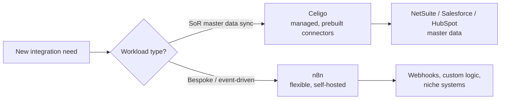
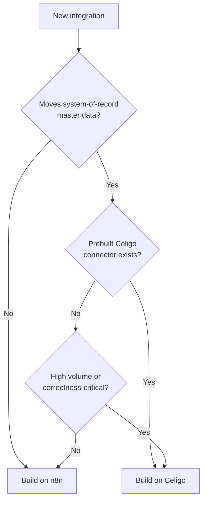

# Ops Automation Platform: Celigo vs. n8n — ADR Summary

## Document Metadata

- **Document type:** ADR / Design Decision Summary
- **Intended audience:** Systems and RevOps leadership, integration engineers, finance (platform cost owners)
- **Repo/system examined:** Brightline ops automation estate — existing n8n workflows and a Celigo proof-of-concept
- **Date:** 2026-05
- **Confidence level:** High for the decision drivers and trade-offs; cost figures are illustrative and flagged
- **Status:** Portfolio sample — built on a fictional scenario (Brightline). Accepted decision as documented.

---

## Executive Summary

Brightline's integration needs have outgrown an informal, all-n8n approach. As the systems team scales its automation estate across NetSuite, Salesforce, HubSpot, and Zendesk, it needs a deliberate platform strategy rather than defaulting every new integration to the same tool.

This ADR records the decision to adopt **Celigo as the primary platform for system-of-record data flows**, while **retaining n8n for event-driven, logic-heavy, and bespoke workflows** where Celigo's prebuilt connectors offer no advantage. The decision is not "one tool wins" — it allocates each workload to the platform whose strengths fit it, and defines a rule for routing future work.

---

## Business Purpose

The systems team is small and its integration surface is growing. Two failure modes threaten that trajectory: over-investing engineering time maintaining self-hosted infrastructure for standardized sync patterns, or over-paying for a managed platform to run simple glue that a webhook handles for free.

The cost of *not* deciding is drift — each new integration built on whichever tool is familiar that week, producing an estate no one can reason about, with reliability and maintenance burden landing unpredictably. This decision exists to give the team a defensible default and a clear rule for the exceptions, so the automation estate scales without scaling headcount or platform spend proportionally.

---

## Scope

### In Scope

- The platform choice for Brightline's integration and automation layer.
- A routing rule for deciding which platform a new integration belongs on.
- The trade-offs, dependencies, and operational consequences of the chosen split.

### Out of Scope

- Migration sequencing for existing workflows (a separate implementation plan).
- Specific integration designs (covered by individual specifications).
- Vendor contract negotiation and final pricing (finance-owned).

---

## Decision Statement

Adopt **Celigo** as the primary integration platform for system-of-record (SoR) data flows — the high-volume, standardized synchronization between NetSuite, Salesforce, and HubSpot where data correctness and managed reliability are paramount.

Retain **n8n** for event-driven, logic-heavy, or bespoke workflows — webhook glue, custom transformations, and integrations with systems that have no prebuilt Celigo connector.

New integrations route to one platform or the other by the rule in the decision flowchart below.

---

## Context

The drivers visible in the current estate and stated constraints:

- **Existing stack is SoR-heavy.** NetSuite, Salesforce, and HubSpot hold the master data. Celigo originated in the NetSuite ecosystem and offers mature prebuilt connectors and Integration Apps for exactly these systems — the workloads that most need managed reliability.
- **The team is small.** Self-hosting the reliability, scaling, and upgrade burden of n8n for SoR-critical flows competes directly with the team's capacity to deliver new work. Managed infrastructure trades cost for reclaimed engineering time.
- **Some workloads are genuinely bespoke.** Event-driven glue, custom logic, and integrations with niche systems get no benefit from prebuilt connectors. For these, n8n's flexibility and zero per-flow cost are decisive, and the maintenance burden is proportionate to the workload's importance.
- **Cost sensitivity is real but secondary to correctness.** A duplicated customer record in NetSuite or a broken revenue sync costs more than the platform subscription. Reliability of SoR flows is the dominant concern.

The decision is therefore contextual: the same factors that make Celigo right for SoR sync make it wrong for cheap bespoke glue, and vice versa.

---

## Alternatives Considered

| Alternative | Summary | Why It Was Not Selected |
|-------------|---------|-------------------------|
| **n8n only** | Keep everything on self-hosted n8n | Self-hosted reliability and scaling burden is too high for SoR-critical flows on a small team; no managed NetSuite connector means rebuilding what Celigo provides out of the box |
| **Celigo only** | Run all automation on Celigo | Cost and rigidity for simple event-driven glue; per-flow overhead is disproportionate for webhook-level work; weaker fit for bespoke custom logic |
| **Make or Zapier** | Adopt a lighter managed iPaaS | Weaker for complex, high-volume NetSuite and Salesforce work; operation/task-based pricing scales unfavorably at Brightline's volume; less control over error handling |
| **Custom-coded integration service** | Build a bespoke TypeScript integration layer | Highest flexibility and control, but highest build and ongoing maintenance cost; does not fit current team capacity; reserves engineering for differentiated work, not plumbing |
| **Celigo primary + n8n secondary (chosen)** | Allocate workloads by fit | Selected — matches each workload to the platform whose strengths fit it, without forcing a single tool onto unsuitable work |

---

## Functional Behavior

Under the chosen split, a new integration is routed by workload type:

- **SoR data sync** (master data between NetSuite, Salesforce, HubSpot; high volume; standardized) → Celigo. The team configures flows on managed infrastructure with prebuilt connectors, retry, and error management.
- **Bespoke / event-driven** (webhook glue, custom transformation logic, niche-system integration) → n8n. The team builds workflows with full flexibility, accepting the self-hosted maintenance burden in proportion to the workload.

The two platforms coexist. A small number of workflows may legitimately touch both — for example, an n8n workflow handling a bespoke event that ultimately writes through a Celigo-managed SoR flow — and the routing rule governs which platform owns each segment.

---

## Dependencies

| Dependency | Why It Matters |
|------------|----------------|
| Celigo subscription and connector entitlements | The primary platform; SoR flows depend on the relevant connectors being licensed |
| n8n self-hosted instance | The secondary platform; bespoke workflows depend on its uptime, owned by the team |
| Team skills across both platforms | The split requires fluency in configuring Celigo *and* building n8n workflows; a single-skill team undermines the strategy |
| Clear routing ownership | Someone must own the decision of which platform a new integration lands on; without it, drift returns |

---

## Risks / Failure Modes

| Risk / Trade-off | Impact | Notes |
|------------------|--------|-------|
| Two platforms to operate | Broader skill and monitoring surface than a single tool | Accepted deliberately; the cost is justified by fit. Mitigated by clear routing and ownership |
| Routing rule erodes over time | Drift back to ad-hoc tool choice | Requires an owner and periodic review; the rule is only as good as its enforcement |
| Celigo vendor lock-in | SoR flows become hard to move off Celigo | Accepted for SoR reliability; mitigated by documenting flows so they remain portable in principle |
| n8n maintenance neglected | Self-hosted instance falls behind on upgrades/reliability | Bespoke workflows still matter; the instance needs an owner even though it is "secondary" |
| Cost creep on Celigo | Subscription grows as connectors are added | Finance owns review; route only workloads that need Celigo to it |

---

## Monitoring / Support Implications

The split has a direct operational consequence: monitoring and support are now two-surfaced. Celigo provides managed error management, retry, and execution history for SoR flows; n8n requires the team to own execution monitoring, error workflows, and instance health for bespoke flows. Each platform's runbook reflects its own failure modes.

Ownership is explicit: a platform owner for Celigo (flows, connectors, cost), an instance owner for n8n (uptime, upgrades, error workflows), and a routing owner who decides where new work lands and reviews the rule periodically. The strategy fails not on technology but on governance — if no one owns routing, the estate drifts back to ad-hoc.

---

## Mermaid Diagrams

### Context Diagram — Workload Allocation

### Decision Flowchart — Routing a New Integration

---

## Assumptions / Unknowns

### Assumptions

- **The current estate is SoR-heavy.** Inferred from the stack (NetSuite, Salesforce, HubSpot). Confirmed by inventorying existing workflows.
- **The team can sustain fluency in both platforms.** Inferred from the decision's premise. Requires confirmation against actual team capacity and training plan.
- **Celigo's connector coverage matches the SoR systems in use.** Inferred from Celigo's NetSuite heritage. Must be confirmed against the specific connector entitlements before committing.

### Unknowns

- The exact crossover volume at which a bespoke n8n flow's maintenance cost exceeds the cost of moving it to Celigo.
- Whether any current SoR system lacks a mature Celigo connector, which would change the routing for that system.
- The total cost of ownership comparison at projected 12-month volume (finance-owned analysis).

---

## Open Questions

- Who owns the routing decision and the periodic review of the rule?
- What is the migration sequence for existing SoR flows currently on n8n — and what is the rollback if a migrated flow underperforms?
- At what volume or complexity threshold does a custom-coded service re-enter consideration for a specific high-value workflow?

---

## Traceability to Repo Artifacts

> Illustrative for this portfolio sample. In a real engagement these resolve to the client's environment.

| Artifact | Why It Was Used |
|----------|-----------------|
| [automation-estate-inventory.md](https://github.com/brightline/ops-platform/blob/main/docs/automation-estate-inventory.md) | Inventory of existing workflows establishing the SoR-heavy profile |
| [celigo-poc-notes.md](https://github.com/brightline/ops-platform/blob/main/docs/celigo-poc-notes.md) | Proof-of-concept findings informing the connector and reliability assessment |
| [n8n-instance-config.md](https://github.com/brightline/ops-platform/blob/main/docs/n8n-instance-config.md) | Current self-hosted setup informing the maintenance-burden trade-off |
| [platform-cost-model.xlsx](https://github.com/brightline/ops-platform/blob/main/finance/platform-cost-model.xlsx) | Illustrative cost inputs (finance-owned; figures not reproduced here) |
